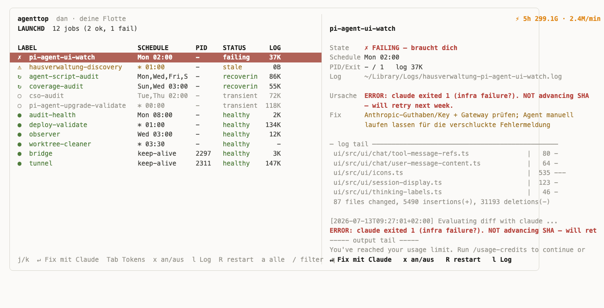

# agenttop

A terminal dashboard — `htop`-style — for the two things running quietly in the background on your Mac:

1. **Your background agents** — every scheduled/persistent job macOS runs for you via **launchd** (`~/Library/LaunchAgents`, `/Library/LaunchAgents`, `/Library/LaunchDaemons`).
2. **Your Claude spend** — how many tokens Claude Code is burning, per model, per project, per session, plus your live Anthropic rate-limit budget.

One screen, master-detail, auto-refreshing every 2 seconds. Zero dependencies — pure Python 3 standard library (`curses` + `json`). It opens in **fleet mode**: your own agents, worst-first, with the selected agent's full state on the right — `↵` opens a fresh Claude Code session split right next to it, already seeded to fix that agent. `Tab` flips the right pane to the Claude/token view; `x` switches an agent on/off.



Healthy rows render **soft green** (grey means deliberately switched OFF via `x`); the one failing agent is the only red thing on screen. `a` shows ALL launchd jobs plus the classic Claude pane:

```
┌ LAUNCHD  35 jobs ──────────────────────────┬ CLAUDE  window: 5h (v cycle) ─────────────┐
│ ● com.houseclaw.tunnel   keep-alive  ok    │ Anthropic limits (live from API headers)  │
│ ○ com.docker.helper      at load     idle  │   5h   12% ███········· reset 2h 41m      │
│ …                                          │ By model / By project / Sessions / 24h    │
└────────────────────────────────────────────┴────────────────────────────────────────────┘
```

---

## Requirements

- **macOS** — uses `launchctl` and `plutil` for the launchd pane.
- **Python 3** — standard library only, nothing to `pip install`.
- **Claude Code CLI** (`claude`) on `PATH` — only needed to fetch live Anthropic rate-limit headers (the right pane's "Anthropic limits" box). Everything else works without it.

## Install

It's a single self-contained script. Drop it on your `PATH` and make it executable:

```sh
chmod +x ~/.local/bin/agenttop
agenttop
```

---

## Left pane — launchd (your background agents)

Lists every launch agent and daemon, with live status pulled from `launchctl list`:

- **Status** — `●` running · `✗` failed (non-zero last exit) · `⚠` running but last exit errored · `○` idle / never run.
- **Schedule** — decoded from the plist: `every 1h`, `Mon 03:00`, `keep-alive`, `at load`, `on path change`, …
- **PID**, **last exit code**, and **log size**.
- Noise like Adobe / Grammarly / OneDrive helpers is filtered out.

**Actions on the selected job:**

| key | action |
|-----|--------|
| `Enter` | **fleet agent: open Claude Code on it** (herdr workspace, seeded prompt) · other jobs: tail log |
| `l` | live-follow its log file (stdout + stderr), any key returns |
| `R` | restart (`launchctl kickstart -k`) |
| `s` | stop (`launchctl kill SIGTERM`) |
| `a` | toggle fleet mode ↔ all launchd jobs |
| `/` | filter by label (Enter applies, Esc cancels) · `c` clears |
| `j`/`k` or `↓`/`↑` | move · `g`/`G` top/bottom |

## Fleet mode (default) — your agents, master-detail

agenttop starts in **fleet mode**: only the agents *you* built (label prefixes in
`FLEET_PREFIXES` — `com.hausverwaltung.*`, `com.houseclaw.*`, `com.dan.*`), never
Microsoft/Adobe/vendor helpers. The left pane lists them **worst-first** with a
health state derived the way a watchdog would:

- a silent skip exits 0, so `LastExitStatus` lies — the log tail's most recent
  outcome line is what gets classified (`failing` / `blocked` / `stale` /
  `recovering` / `transient` / `healthy`),
- a dirty-tree block is re-checked against the repo *now* (clean again →
  `recovering`, not a stale alarm),
- a keep-alive service with a live PID is healthy no matter how quiet its log,
- a log untouched for 14+ days means the job isn't firing, whatever it last said.

The right pane is the **detail view** of the selected agent: state, schedule,
cause, a concrete fix hint, and a live log tail. `Enter` opens **Claude Code in a
fresh herdr workspace, already seeded** with that agent's plist, program, log and
symptom — investigate and improve it in one keystroke. While agenttop is open, an
agent flipping to failing/blocked fires a clickable macOS notification
(`terminal-notifier`), same anti-silent-failure guard the Observer cron applies
between its weekly runs. Claude spend stays visible as a compact `⚡` header badge;
`a` brings back the classic two-pane view (all jobs + full Claude pane).

> System daemons in `/Library/LaunchDaemons` need `sudo` to restart — agenttop tells you the exact command when permission is denied.

## Right pane — Claude usage & spend

Reads your Claude Code session logs in `~/.claude/projects/**/*.jsonl` and aggregates them. Token counts are the exact `usage` numbers Anthropic returned for each request — no estimation.

- **Anthropic limits (live)** — real `anthropic-ratelimit-*` headers, fetched by making one tiny `claude -p .` call (costs **1 billable message**), cached for an hour. Shows your 5h and 7d utilization, reset countdown, and status.
- **Local activity** — input / output / cache tokens, session and message counts for the current window.
- **By model** and **By project** — ranked bar breakdowns.
- **Sessions** — active sessions with git branch, model, last-seen, and total tokens. `Enter` live-tails one (every new assistant message streams in as a row).
- **Last 24h** — peak tokens/min per hour, as twin sparklines (the same metric Anthropic's Console rate-limit graph shows).

| key | action |
|-----|--------|
| `v` | cycle window: `5h` → `today` → `7d` |
| `Enter` | live-tail the selected session |
| `j`/`k` or `↓`/`↑` | move selection |

## Global keys

| key | action |
|-----|--------|
| `Tab` | switch pane focus |
| `r` | force refresh |
| `f` | fetch Anthropic limits now (costs 1 message) |
| `q` | quit |

---

## Performance — the aggregated index (v2)

The Claude pane parses your entire `~/.claude/projects` history (often hundreds of MB, millions of JSONL lines) — once. From then on it reads only appended bytes, and **stores no raw events at all**: no view ever displays a single event, everything is a windowed sum, and the finest resolution any view needs is one *minute* (the 24h chart plots peak tokens/min). So the index aggregates at ingest:

- **minute grain** for the last 48h (5h window, today, 24h chart, session tails, burn rate),
- **day + hour grain** for 31 days (7d window, daily history, the historic max-5h baseline).

Measured on a heavy real-world history (~800k events/day): the v1 raw-event cache had grown to **1.4 GB / 17M tuples, 4s cold load, seconds per refresh tick**. v2 is **~9 MB, 156ms cold load, ~2ms per frame** — verified against the raw data (5h/today totals and the 24h peaks are bit-identical; the far edge of a rolling 7d window rounds to calendar days).

- A v1 cache is migrated in place on first launch (no re-parse of the jsonl history).
- The cache is rebuildable — delete it any time; it's regenerated on the next run. It also self-invalidates on a schema-version bump or corruption.

## Command-line (non-interactive) modes

For scripts, cron, or a quick glance without the TUI:

```sh
agenttop --once                  # print the launchd job table once and exit
agenttop --once-claude           # print a Claude usage summary (makes 1 billable call)
agenttop --once-claude --no-fetch # same, but use cached rate-limit headers (free)
```

These share the same on-disk index cache, so running `--once-claude` also warms it for the TUI.

---

## Where it keeps state

| path | what |
|------|------|
| `~/.cache/agenttop/index-cache.pkl` | parsed Claude usage index (rebuildable) |
| `~/.cache/agenttop/anthropic-limits.json` | last fetched rate-limit headers (1h TTL) |

Both are caches — safe to delete; agenttop regenerates them.

---

## herdr integration — jump from dashboard into a live session

agenttop doesn't just *show* you a failing agent — it gets you into a working session on it. With [herdr](https://github.com/patzaa/herdr) (terminal workspace manager) installed, agenttop can **automatically launch new terminals**:

- **↵ on any agent in the fleet pane** opens a fresh herdr workspace running a **Claude Code session pre-seeded to investigate and improve exactly that agent** — its script, its plist, its log. No copy-pasting paths; you land in a session that already has the context.
- The agent fleet itself closes the loop from the other side: when a background agent fails or needs input, it posts a **clickable macOS notification** — clicking it opens a herdr pane with a seeded Claude Code session in the affected directory. Dashboard or notification, either way you're one keypress/click from a contextualized session.

Without herdr, ↵ falls back gracefully (herdr is optional for everything else).

## The fleet it watches

The actual background agents running on this machine (upgrade validation, release-notes review, security/UI watch, deploy validation, audits, worktree cleanup) live in [`patzaa/hausverwaltung-agents`](https://github.com/patzaa/hausverwaltung-agents) — scripts, launchd plists, shared libraries, and the clickable-notification helpers, with a README describing every agent and its schedule.

---

## License

MIT — see [LICENSE](LICENSE).
